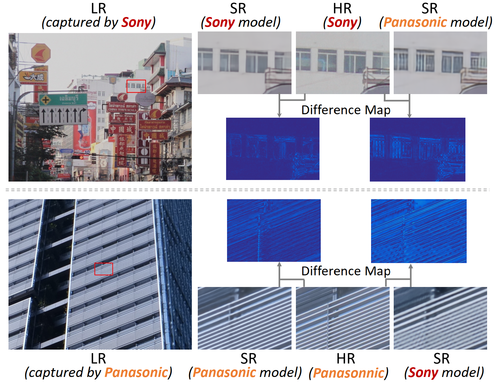
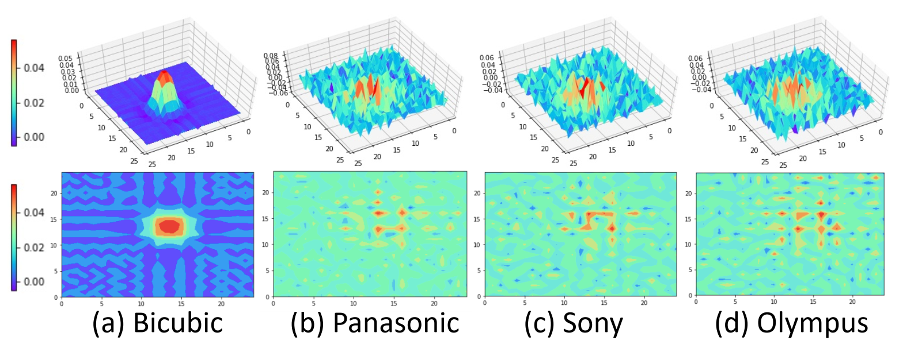

# DADA

Pytorch code of CVPR-2022 paper: [Dual Adversarial Adaptation for Cross-Device Real-World Image Super-Resolution.](https://arxiv.org/abs/2205.03524v1)






## Requirements

- Pytorch == 1.5.1
- torchvision == 0.6.0
- opencv-python
- tensorboardX


## Usage

### Data Preparation

Download the [DRealSR](https://github.com/xiezw5/Component-Divide-and-Conquer-for-Real-World-Image-Super-Resolution) dataset and set the corresponding dataset path in `constant.py`.

Image files for different cameras are listed in `./image_list/train.csv` and `./image_list/test.csv` (for `x4` scale factor).


### Training

1. Train the up-sampling model:

   ```shell
   cd script
   sh train_up.sh
   ```

2. Train up-sampling model and down-sampling model collabotively:

   ```shell
   cd script
   sh train_circle.sh
   ```

3. Train DADA:

   ```shell
   cd script
   sh train_adapt.sh
   ```

   

### Testing

```shell
cd script
sh test_adapt.sh
```


### Pretrained models

Pretrianed models will be uploaded soon.


## Citiation

```
@article{xu2022dual,
  title={Dual Adversarial Adaptation for Cross-Device Real-World Image Super-Resolution},
  author={Xu, Xiaoqian and Wei, Pengxu and Chen, Weikai and Mao, Mingzhi and Lin, Liang and Li, Guanbin},
  journal={arXiv preprint arXiv:2205.03524},
  year={2022}
}
```

